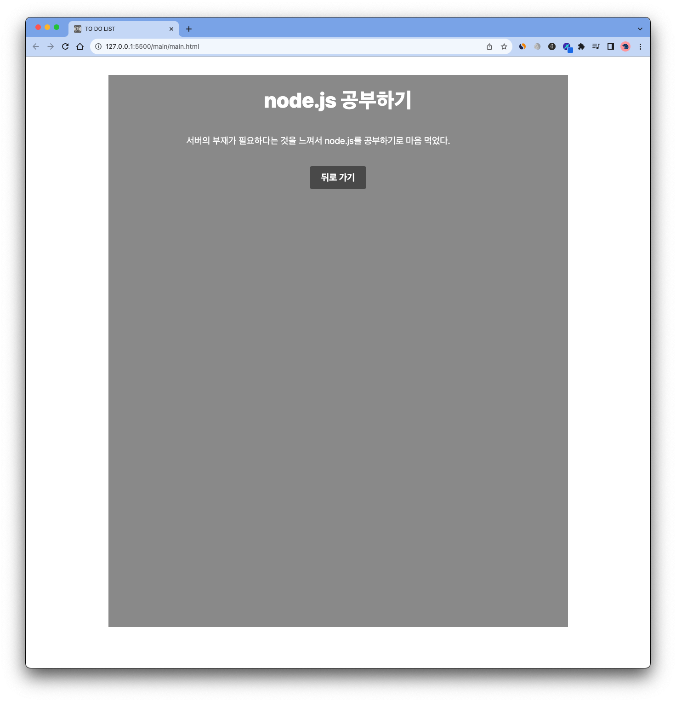

# TODOLIST


## 프로젝트에 대해서 

```
HTML, CSS, JS를 적극 활용해서 나만의 TODOLIST 웹 사이트를 제작했다.
```

<br>


## 👦🏻 느낀점

### Good
1. JS에 대한 이해도가 많이 올라간 것 같다.
2. node.js를 배워 localStorage를 사용하지 않고 서버를 이용해야겠다는 생각을 갖게 되었다. 

### Bad
1. 아직은 HTML과 CSS에 대한 숙련도가 부족한 것 같다.
2. 전반적인 JS 코드가 난잡하다. -> 추후 리팩토링으로 코드를 개선할 계획이다.


<br>

## 사용한 프레임워크및 클래스 
 - LocalStorage

<br>

## 👨🏻‍💻 웹사이트 화면

    
